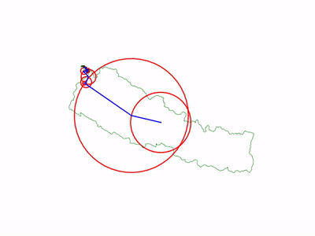

# **Drawing with DFT and Epicycles**

[](https://travis-ci.com/Amritaryal44/drawing-with-DFT-and-epicycle)

Draw any figure using maths with the use of DFT(fouries series in exponential form) and epicycle
## Example
| real figure |
|:--:|
|  | 

| generated figure |
|:--:|
|  |


## Installation

Install ffmpeg
You will need to install ffmpeg to write the animation to video file
```sh
$ sudo apt-get update
$ sudo apt-get install ffmpeg
```

Clone the repository
```sh
$ git clone https://github.com/Amritaryal44/drawing-with-DFT-and-epicycle.git
```
Install all package requirements for python
```sh
$ pip install -r requirements.txt
```

## DFT_epicycle explaination
#### 1. Read the image and convert to gray scale
```python
img = cv2.imread("nepal.png")
img_gray = cv2.cvtColor(img, cv2.COLOR_BGR2GRAY)
```
#### 2. Threshold the gray image to get pure black and white image
```python
ret, thresh = cv2.threshold(img_gray, 127, 255, 0)
```
#### 3. Find the contour of image
```python
contours, hierarchy = cv2.findContours(thresh, cv2.RETR_TREE, cv2.CHAIN_APPROX_NONE)
```
We get two contours here:
| ```contours[0]``` |
|:--:|
|  | 

| ```contours[1]``` |
|:--:|
|  | 

But we need ```contours[1]```. so:
```python
contours = np.array(contours[1]) 
```
#### 4. Split the points and store in ```x_list``` and ```y_list```
Without reshaping:
```python
x_list, y_list = contours[:, :, 0], -contours[:, :, 1]
print(x_list.shape)
```
> Note that ```y_list``` is given as ``` -contours[:, :, 1]``` because we want the y points to be upright. 

Output: 
```sh
(5541, 1)
```
So the shape is in 2D. To make it 1D: 
> We are making it in 1D because later we will need 1D data for making f(t)
> in ```np.interp()``` function 
```python
x_list, y_list = contours[:, :, 0].reshape(-1,), -contours[:, :, 1].reshape(-1,)
print(x_list.shape)
```
Note that for reshaping ```(a,b)```, ```(-1,)``` is similar to ```(a*b,)```
Output: 
```sh
(5541,)
```
If you plot the points in matplotlib, you will get:
```python
fig = plt.figure()
ax = fig.add_subplot(111)
ax.plot(x_list, y_list)
plt.show()
```
output:

The figure is not centerer somewhere at ```(1000, -600)``` But we want the figure to be centered at ```(0,0)``` for using fourier series calculation easily.
#### 5. Centering the points to origin: ```(0,0)```
```python
# center the contour to origin
x_list = x_list - np.mean(x_list)
y_list = y_list - np.mean(y_list)
```
Here, we are translating every points by mean of points. We are doing just translation operation here.
If you plot the points in matplotlib again, you will get:
```python
fig = plt.figure()
ax = fig.add_subplot(111)
ax.plot(x_list, y_list)
plt.show()
```
output:


Store the size information of the figure because later you will want the generated image to be fit in the figure.
We will use it later.
```python
xlim_data = plt.xlim() 
ylim_data = plt.ylim()
```

#### 6. Make a time_list from 0 to 
We are doing this, because we are rotating the circle. To rotate a circle, we need angle. Later we will use this angle to determine . Later you will use it for calculating fourier coefficients.
```python
t_list = np.linspace(0, tau, len(x_list))
print(t_list)
```
Output:
```sh
[0.00000000e+00 1.13414897e-03 2.26829794e-03 ... 6.28091701e+00
 6.28205116e+00 6.28318531e+00]
```
It will go from 0 to ```tau```. Tau is just 

#### 7. Find the fourier coefficients to approximately locate given points
Fourier Coefficient Formula is:
> 

> where :
>  = coefficient calculated which is in form  or  where r is radius of circle and t gives the position of point in circumference of circle
> f(t) = returns x, y points at time t. Note that we have created ```time_list```. that was for this.
> t = time i.e from 0 to 

Please watch [this video][explained] for better understanding.
Coefficients will be in sequence like: ......
More and more coefficients means better result.
So we will define ```order=100``` for now. which goes from $$c_{-order}$$ to 
```python
order = 100
```
Let us make a loop to store coefficients in ```c```
```python
c = [] # a list to store coefficients from -order to order
for n in range(-order, order+1):
    pass
```
Now this loop will go from -order to order. 
Let's make a function f(t) so that we can get x+iy at any time t. 
```python
def f(t, t_list, x_list, y_list):
    return np.interp(t, t_list, x_list + 1j*y_list)
```
Here, ```np.interp()``` is used to generate x+iy at time t.
Let me clear you a bit.
```python
x = 2
xp = [1, 3, 5]
yp = [10+20j, 30+40j, 50+60j]
y = np.interp(x, xp, yp) 

print (y) 
```
output:
```sh
(20+30j)
```
You see it was that simple.
Now Let's go to the loop and use the fourier coefficient formula.
```python
c = [] # a list to store coefficients from -order to order
for n in range(-order, order+1):
    coef = 1/tau*quad_vec(lambda t: f(t, t_list, x_list, y_list)*np.exp(-n*t*1j), 0, tau, limit=100, full_output=1)[0]
    c.append(coef)
```
```scipy.integrate.quad_vec()``` is used to do defininte integration over complex data.
Here we put ```[0]``` at the end of ```quad_vec()``` because ```quad_vec()``` returns ```(value, error)```.
After integration, we will append the coefficient in list.
Let me demonstrate ```quad_vec()``` in simple way.
```python
def f(x):
  return x+1j

# using scipy.integrate.quad() method 
result = quad_vec(lambda x: f(x), 0, 3)[0]

print(result) 
```
The above code does the formula:

Try it yourself. You will get almost same output as below.
output:
```sh
(4.5+3.000000000000001j)
```
Now we are done with finding coefficients.
Note that ```tqdm``` is used for making progressbar. I will not explain it.
If you want to save the coefficients for later use, you can save it.
```python
# convert list into numpy array
c = np.array(c)
# save it
np.save("coeff.npy", c)
```
Hurray!!! We are almost done.
## Now time to make animation.
This is the interesting part of this project. We will make about 300 rotating circles to draw the figure we wanted.
Let me show you how circles and coefficients are related
For example, we have 3 coefficients.


When we plot the coefficients in figure, we will get result as follow:
|  |
|:--:|
| ![coeff[0]](img_md/c0.png) |
|   and  |

| adding  to  |
|:--:|
| ![coeff[1]](img_md/c1.png) |
|   and  |

| adding  to  |
|:--:|
| ![coeff[-1]](img_md/c-1.png) |
|   and  |

The direction of last circle is used to plot the drawing points.
In this way, circles are created. But we have to sort the coefficients to get the order like: 
#### 1. Let's make a function to sort the coefficients.
Our coefficient is arranged as:  
```python
# Let us assume the coefficients as given in example
coeffs = np.array([2-2j,10+5j,-10-10j])
order = 1 
def sort_coeff(coeffs):
    new_coeffs = []
    new_coeffs.append(coeffs[order])
    for i in range(1, order+1):
        new_coeffs.extend([coeffs[order+i],coeffs[order-i]])
    return np.array(new_coeffs)
print(sort_coeff(coeffs))
```
Output:
```sh
[ 10. +5.j -10.-10.j   2. -2.j]
```
Look at the output, we have sorted them in order like: 

#### 2. How to make circles and lines in matplotlib
**Making a circle**
Formula for ploting the circle is :

```python
fig, ax = plt.subplots()
ax.set_aspect('equal') # to make the axes symmetric

theta = np.linspace(0, tau, num=50) # 0, ...,... , tau 
r = 20
x, y = r * np.cos(theta), r * np.sin(theta)
ax.plot(x, y, 'r-')
plt.show()
```
Output:


**Making a radius in circle show direction of rotation**
Let us copy the circle code and make a line here.
We will draw the line from center of circle and align at  = tau/8
```python
fig, ax = plt.subplots()
ax.set_aspect('equal') # to make the axes symmetric

theta = np.linspace(0, tau, num=50) # 0, ...,... , tau 
r = 20
x, y = r * np.cos(theta), r * np.sin(theta)

# draw a line to indicate the direction of circle
x, y = [0, r*np.cos(tau/8)], [0, r*np.sin(tau/8)]
ax.plot(x, y, 'g-')

ax.plot(x, y, 'r-')
plt.show()
```

I hope you understand how to make lines and circles in matplotlib. Later we will use the code directly.

#### 3. Now we will join the circles and lines in the figure
Note that center point of next circle is the coefficient point of a circle.
I have already said that coefficients are nothing but information about the radius and radius direction in current circle. To rotate a circle, we can do:
 where t is from 0 to tau. 
when t = tau/2, the circle will rotate about $$90^0$$ anticlockwise.

Now let's make the function.
```python
def make_frame(i, time, coeffs):
    pass
```
Here, ```time``` is list of angles from 0 to ```tau```. this is responsible for animation.
```i``` is the frame number. It will go from 0 to ```len(time)```.
Now inside the function, we will follow following steps.
##### I. First of all we need to break the coefficients into x_coefficient and y_coefficient.
code:
```python
# sort the coefficient first. 
coeffs = sort_coeff(coeffs)

# split into x and y coefficients
x_coeffs = np.real(coeffs)
y_coeffs = np.imag(coeffs)
```
##### II. Loop to make all the circles for all coefficients
code inside function:
```python
# make all circles i.e epicycle
for i, (x_coeff, y_coeff) in enumerate(zip(x_coeffs, y_coeffs)):
    # calculate radius of current circle
    r = np.linalg.norm([x_coeff, y_coeff]) # similar to magnitude: sqrt(x^2+y^2)
    
    theta = np.linspace(0, tau, num=50) # theta should go from 0 to 2*PI to get all points of circle
    x, y = center_x + r * np.cos(theta), center_y + r * np.sin(theta)
    circles[i].set_data(x, y)
```
You may be confused about the ```circles[i].set_data(x, y)```
We need to define it first. Let's go out of the function and define all necessary parameters.
```python
# make figure for animation
fig, ax = plt.subplots()

# different plots to make epicycle
# there are -order to order numbers of circles
circles = [ax.plot([], [], 'r-')[0] for i in range(-order, order+1)]
# circle_lines are radius of each circles
circle_lines = [ax.plot([], [], 'b-')[0] for i in range(-order, order+1)]
# drawing is plot of final drawing
drawing, = ax.plot([], [], 'k-', linewidth=2)

# to fix the size of figure so that the figure does not get cropped/trimmed
ax.set_xlim(xlim_data[0]-200, xlim_data[1]+200)
ax.set_ylim(ylim_data[0]-200, ylim_data[1]+200)

# hide axes
ax.set_axis_off()

# to have symmetric axes
ax.set_aspect('equal')
```
Again let's go inside the function and proceed the code.
Now we will make the radius line.
```python
# center points for fisrt circle
center_x, center_y = 0, 0

# make all circles i.e epicycle
for i, (x_coeff, y_coeff) in enumerate(zip(x_coeffs, y_coeffs)):
    # calculate radius of current circle
    r = np.linalg.norm([x_coeff, y_coeff]) # similar to magnitude: sqrt(x^2+y^2)
    
    theta = np.linspace(0, tau, num=50) # theta should go from 0 to 2*PI to get all points of circle
    x, y = center_x + r * np.cos(theta), center_y + r * np.sin(theta)
    circles[i].set_data(x, y)
    
    # draw a line to indicate the direction of circle
    x, y = [center_x, center_x + x_coeff], [center_y, center_y + y_coeff]
    circle_lines[i].set_data(x, y)
    
    # calculate center for next circle
    center_x, center_y = center_x + x_coeff, center_y + y_coeff
```

What is the damn ```i``` for??
How to make animation??
Remember!!! 
We need to multiply coefficient with exponential term as discussed already.
So, let's multiply the coefficients with exponential term before sorting out.

```python
# exponential term to be multiplied with coefficient 
exp_term = np.array([np.exp(n*t*1j) for n in range(-order, order+1)])

# sort the terms of fourier expression
coeffs = sort_coeff(coeffs*exp_term)
```

#### Code upto now should be like:
```python
def make_frame(i, time, coeffs):
    global pbar
    # get t from time
    t = time[i]

    # exponential term to be multiplied with coefficient 
    # this is responsible for making rotation of circle
    exp_term = np.array([np.exp(n*t*1j) for n in range(-order, order+1)])

    # sort the terms of fourier expression
    coeffs = sort_coeff(coeffs*exp_term) # coeffs*exp_term makes the circle rotate. 
    # coeffs itself gives only direction and size of circle

    # split into x and y coefficients
    x_coeffs = np.real(coeffs)
    y_coeffs = np.imag(coeffs)

    # center points for fisrt circle
    center_x, center_y = 0, 0

    # make all circles i.e epicycle
    for i, (x_coeff, y_coeff) in enumerate(zip(x_coeffs, y_coeffs)):
        # calculate radius of current circle
        r = np.linalg.norm([x_coeff, y_coeff]) # similar to magnitude: sqrt(x^2+y^2)

        # draw circle with given radius at given center points of circle
        # circumference points: x = center_x + r * cos(theta), y = center_y + r * sin(theta)
        theta = np.linspace(0, tau, num=50) # theta should go from 0 to 2*PI to get all points of circle
        x, y = center_x + r * np.cos(theta), center_y + r * np.sin(theta)
        circles[i].set_data(x, y)

        # draw a line to indicate the direction of circle
        x, y = [center_x, center_x + x_coeff], [center_y, center_y + y_coeff]
        circle_lines[i].set_data(x, y)

        # calculate center for next circle
        center_x, center_y = center_x + x_coeff, center_y + y_coeff
```

Now we need to draw the figure. As I have already said that the last center point we get is the point of figure.
We need to save all the last points ```(center_x, center_y)``` in a list say ```draw_x``` and ```draw_y```.

#### THe whole code of ```make_frame()``` should be:
```python
draw_x, draw_y = [], []
def make_frame(i, time, coeffs):
    global pbar
    # get t from time
    t = time[i]

    # exponential term to be multiplied with coefficient 
    # this is responsible for making rotation of circle
    exp_term = np.array([np.exp(n*t*1j) for n in range(-order, order+1)])

    # sort the terms of fourier expression
    coeffs = sort_coeff(coeffs*exp_term) # coeffs*exp_term makes the circle rotate. 
    # coeffs itself gives only direction and size of circle

    # split into x and y coefficients
    x_coeffs = np.real(coeffs)
    y_coeffs = np.imag(coeffs)

    # center points for fisrt circle
    center_x, center_y = 0, 0

    # make all circles i.e epicycle
    for i, (x_coeff, y_coeff) in enumerate(zip(x_coeffs, y_coeffs)):
        # calculate radius of current circle
        r = np.linalg.norm([x_coeff, y_coeff]) # similar to magnitude: sqrt(x^2+y^2)

        # draw circle with given radius at given center points of circle
        # circumference points: x = center_x + r * cos(theta), y = center_y + r * sin(theta)
        theta = np.linspace(0, tau, num=50) # theta should go from 0 to 2*PI to get all points of circle
        x, y = center_x + r * np.cos(theta), center_y + r * np.sin(theta)
        circles[i].set_data(x, y)

        # draw a line to indicate the direction of circle
        x, y = [center_x, center_x + x_coeff], [center_y, center_y + y_coeff]
        circle_lines[i].set_data(x, y)

        # calculate center for next circle
        center_x, center_y = center_x + x_coeff, center_y + y_coeff
    
    # center points now are points from last circle
    # these points are used as drawing points
    draw_x.append(center_x)
    draw_y.append(center_y)

    # draw the curve from last point
    drawing.set_data(draw_x, draw_y)
```

#### 4. Making animation with matplotlib
Take your time and understand this code.
An example code:
```python
import numpy as np
import matplotlib.pyplot as plt
import matplotlib.animation as animation

def update_line(num, data, line):
    line.set_data(data[..., :num])
    return line, 

# Set up formatting for the movie files
Writer = animation.writers['ffmpeg']
writer = Writer(fps=15, metadata=dict(artist='Me'), bitrate=1800)

fig1 = plt.figure()

data = np.random.rand(2, 25)
l, = plt.plot([], [], 'r-')
plt.xlim(0, 1)
plt.ylim(0, 1)
plt.xlabel('x')
plt.title('test')
anim = animation.FuncAnimation(fig1, update_line, 25, fargs=(data, l),
                                   interval=50)
anim.save('lines.mp4', writer=writer)
```
Now, we will use the same style of code for our code.
In place of ```update_line()```, we will use ```make_frame()``` function.
The first parameter is ```i``` in ```make_frame()``` which will be frame number supplied over time.
Other parameters are placed in ```fargs=(time, c)``` as we need time and coefficients as argument.
Let's say we want the total frames to be 300. Then we need to put ```frames=300``` in ```animation.FuncAnimation()``` .
```time``` should be from 0 to ```tau``` with 300 numbers.
So the code will be like:
```python
# make animation
# time is array from 0 to tau 
frames = 300
time = np.linspace(0, tau, num=frames)
anim = animation.FuncAnimation(fig, make_frame, frames=frames, fargs=(time, c),interval=5)
anim.save('epicycle.mp4', writer=writer)
pbar.close()
print("completed: epicycle.mp4")
```

Hurray!!! We are done.

I am very thankful to [youtube/3Blue1Brown][3Blue1Brown] for their wonderful explanation.

   [3Blue1Brown]: <https://www.youtube.com/channel/UCYO_jab_esuFRV4b17AJtAw>
   [explained]: <https://www.youtube.com/watch?v=r6sGWTCMz2k>